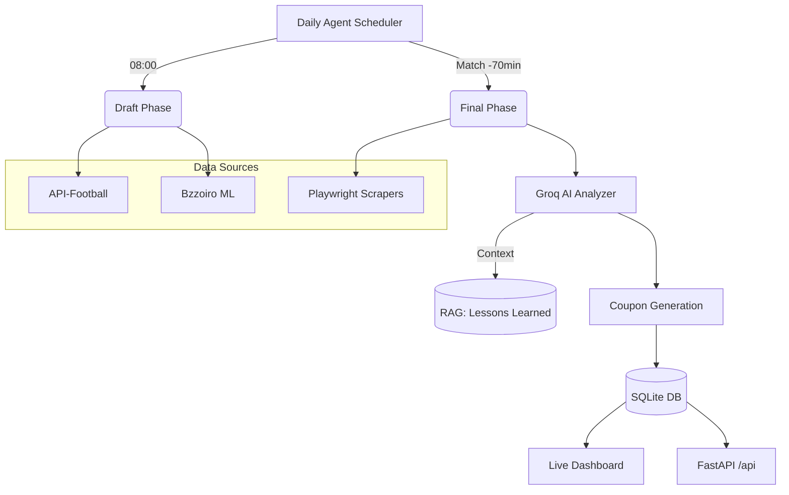

# ⚽ FootStats v3.3 — Ultra-Skeptical AI & Autonomous Prediction Engine

[](https://www.python.org/)
[](https://opensource.org/licenses/MIT)
[](https://fastapi.tiangolo.com/)
[](https://streamlit.io/)
[](https://playwright.dev/)

**FootStats** to zaawansowany system autonomicznego typowania wyników piłkarskich, łączący klasyczną statystykę (Poisson) z nowoczesnym Machine Learningiem i agentami AI (LLM). Projekt został zaprojektowany z myślą o pełnej automatyzacji — od pobierania danych i analizy składów, przez generowanie kuponów, aż po rozliczanie wyników i naukę na własnych błędach (RAG Feedback Loop).

---

## 🚀 Dlaczego ten projekt? (Dla Rekrutera)

Ten projekt demonstruje umiejętności w kluczowych obszarach nowoczesnej inżynierii oprogramowania:
- **Autonomous Agents**: System działa bezobsługowo dzięki schedulerowi i logice "Draft -> Final", która uwzględnia składy meczowe 70 min przed gwizdkiem.
- **RAG & AI Feedback Loop**: AI (Groq/Llama 3.1) analizuje przegrane kupony, wyciąga wnioski i zapisuje je w bazie wektorowej, aby nie powtórzyć tych samych błędów w przyszłości.
- **Advanced Scraping**: Wykorzystanie Playwrighta do omijania zabezpieczeń i pobierania danych z dynamicznych witryn (Superbet, FlashScore) oraz bezpośrednie integracje z API.
- **Full-Stack Insights**: Backend w FastAPI, frontend statystyk w Streamlit, baza danych SQLite i pełna konteneryzacja (Docker).
- **Quality Assurance**: Solidny zestaw testów (pytest) pokrywający krytyczną logikę matematyczną i integracje.

---

## 🏗️ Architektura Systemu



---

## 🛠️ Tech Stack

- **Core**: Python 3.11+
- **AI/ML**: Groq (Llama-3.1-70B/8B), CatBoost (Bzzoiro), Poisson Distribution
- **Scraping**: Playwright, BeautifulSoup4
- **API/Web**: FastAPI, Streamlit, Uvicorn
- **Storage**: SQLite, Pandas, NumPy
- **Automation**: Windows Task Scheduler / Cron
- **DevOps**: Docker, Docker Compose, Sentry

---

## 🌟 Główne Funkcje

- **Ultra-Skeptical AI Analyzer** – Groq nie szuka "dlaczego wygrają", ale "dlaczego mogą przegrać". Każdy typ posiada obowiązkową sekcję analizy ryzyka.
- **BetBuilder Engine** – Algorytm generujący kombinacje zdarzeń (np. 1X + Over 2.5 + Player Shots) z obliczonym EV.
- **Referee Integration** – Statystyki sędziów (żółte kartki, rzuty karne) są wstrzykiwane do kontekstu AI.
- **Kelly Criterion v2** – Dynamiczne zarządzanie kapitałem uwzględniające aktualną formę bota i hit-rate.
- **Automated Settlement** – System sam sprawdza wyniki meczów i rozlicza bankroll w bazie danych.

---

## 🧠 "Second Mind" — AI Knowledge Graph

FootStats posiada wbudowany system wizualizacji wiedzy, który w czasie rzeczywistym pokazuje strukturę systemu oraz **lekcje wyciągnięte z ostatnich meczów**.

- **Lokalizacja**: `brain_graph.html` (otwórz w przeglądarce)
- **Funkcja**: Dynamiczne mapowanie wniosków (RAG) z bazy SQLite na graf relacji między drużynami, sędziami i strategiami.
- **Premium UI**: Wykorzystuje bibliotekę `vis-network` z customowym, "hakerskim" motywem dark-mode.

---

## 📦 Struktura Projektu

```plaintext
FootStats/
├── src/footstats/         # Główny pakiet Python (AI, Core, Scrapers)
├── scripts/               # Narzędzia i automatyzacja (np. wizualizacja grafu)
├── tests/                 # Suita testowa (>100 testów)
├── data/                  # Bazy SQLite i cache
└── assets/                # Dokumentacja wizualna i diagramy
```

## 🛠️ Instalacja i Uruchomienie

1. **Klonowanie i Środowisko**:
   ```bash
   git clone https://github.com/user/footstats.git
   cd footstats
   python -m venv .venv
   source .venv/bin/activate  # lub .venv\Scripts\activate
   pip install -e .
   ```

2. **Konfiguracja**: Uzupełnij `.env` (klucze GROQ_API_KEY, API_FOOTBALL_KEY).

3. **Uruchomienie Dashboardu**:
   ```bash
   python -m streamlit run src/footstats/dashboard.py
   ```

4. **Kalibracja (v3.4)**: Jeśli chcesz odświeżyć parametry modelu Poisson:
   ```bash
   python -m footstats.core.lambda_optimizer
   ```

5. **Wizualizacja Mózgu**:
   ```bash
   python scripts/visualize_brain.py
   # Otwórz brain_graph.html w przeglądarce
   ```

## Testy

```bash
pytest tests/ -v
```

## Licencja

MIT License
